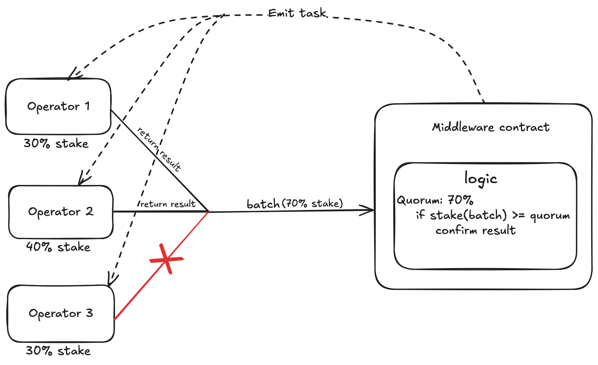

# AVS consensus

For each AVS, all of its operators have to interface through a middleware layer to relay/receive data on chain (receive tasks and return their result). In this layer, we have a configurable value `quorum` which is a percentage value indicate the threshold of stake amount needed consensus. That is, for every task emitted, each of the AVS's operators should return a signed message containing result to the middleware layer, if the amount of stake delegated to the operators having submitted reaches the `quorum` then we confirm a result for that task, in other word, the AVS has reached consensus for that task. 

