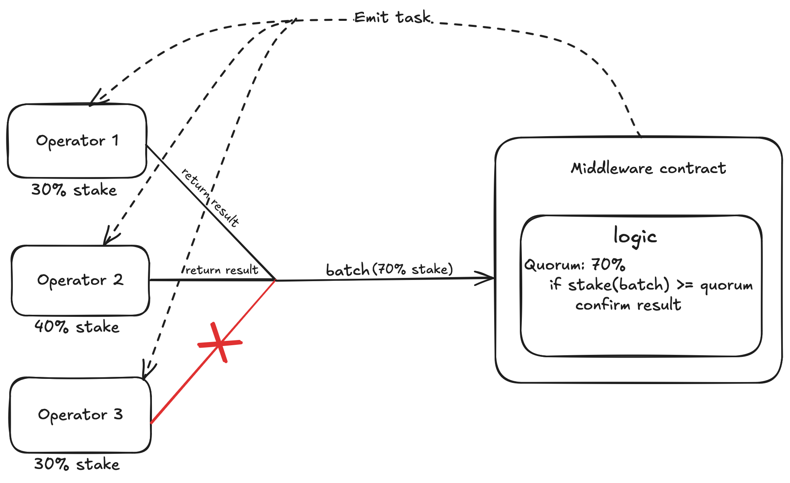

# Sentra Layer AVS on Sonic SVM


## Requiments

- Git
- Golang : version > 1.22
- Already registered as an Operator in Sonic SVM Restaking core

## Minimum hardware requirements:

| Component     | Specification     |
|---------------|-------------------|
| **CPU**       | 16 cores          |
| **Memory**    | 32 GB RAM         |
| **Bandwidth** | 1 Gbps            |
| **Storage**   | 256 GB disk space |

## Steps to running an Operator

Step 1: Clone the repository

```bash
git clone https://github.com/A2Dsquad/sonic-svm-avs
cd avs
```

Step 2: Build the Operator binary

```bash
go build -mod=readonly -o ./build/avs ./cmd
```

Step 3: Configure the Operator

```bash
./build/avs operator config {avs address} {Aggregator rpc}
```

This will create a `operator-config.json` file in `config` folder. You can see the example in `config/example.json`.

Step 4: Start Operator
```bash
./build/avs operator start
```

Your operator is now up and running!

## AVS consensus

For each AVS, all of its operators have to interface through a middleware layer to relay/receive data on chain (receive tasks and return their result). In this layer, we have a configurable value `quorum` which is a percentage value indicate the threshold of stake amount needed consensus. That is, for every task emitted, each of the AVS's operators should return a signed message containing result to the middleware layer, if the amount of stake delegated to the operators having submitted reaches the `quorum` then we confirm a result for that task, in other word, the AVS has reached consensus for that task. 



## Structure

### Operator

The Operator component is responsible for interacting with the Solana blockchain to fetch and respond to tasks. It continuously monitors task creation events, processes tasks, and submits signed responses to the aggregator.

#### Features

Continuously fetches tasks from the blockchain.

Queues unprocessed tasks.

Signs and submits task responses.

Gracefully handles shutdown signals.

Implements retries and backoff strategies.

#### Constants

`MaxRetries`: Maximum number of retries for operations.

`RetryInterval`: Time between retry attempts.

`BlockInterval`: Interval for block polling.

`PollLatestBatchInterval`: Interval for polling the latest batch of tasks.

`RemoveBatchFromSetInterval`: Interval for cleaning up old batches.

#### Start Process

The Start function initializes the operator and starts two goroutines:

`FetchTasks`: Continuously fetches new tasks from the blockchain and queues them.

`RespondTask`: Processes queued tasks, signs responses, and submits them to the aggregator.

The process listens for termination signals `(SIGINT and SIGTERM)` to gracefully shut down.

#### Task Fetching

The `FetchTasks` function:

Creates a Solana client.

Continuously polls for new tasks.

If a new task is detected, it is queued for processing.

#### Task Processing

The `RespondTask` function:

Reads from the TaskQueue.

Extracts the requested data (e.g., a token price) and retrieves the required information.

Computes a message hash and signs it using BLS.

Sends the signed response to the aggregator.

#### Helper Functions

```go
GetMsgHash(client, contract, taskId, response): Retrieves the message hash for a given task.

QueueTask(ctx, client, start, end): Queues unprocessed tasks.

LoadTaskById(client, contract, taskId): Loads task details by task ID.

LatestTaskCount(client, contract): Retrieves the latest task count from the blockchain.
```

#### Shutdown Handling

The operator listens for OS signals `(SIGINT, SIGTERM)` and gracefully terminates the process, ensuring any ongoing operations are completed properly.

#### Error Handling & Retries

If fetching tasks fails, the operator logs a warning and retries after `RetryInterval`.

If queueing tasks fails, it logs an error and continues processing.

If signing or submitting a response fails, the process logs the failure and moves on to the next task.

#### Commands
1. `OperatorCommand`

Description:
`OperatorCommand` is a general command interface for managing operator actions within the AVS. It serves as the base command structure that other operations extend.

Usage:

Acts as a wrapper for core operator functions.

Ensures standardized execution flow for all AVS-related operator commands.

Can trigger different subcommands like `CreateOperatorConfig`, `InitializeQuorum`, and `Deregister`.

2. `CreateOperatorConfig`

Description:
This command initializes an operator configuration, registering it within the AVS. It defines the operator's parameters, including restaking details and network settings.

Usage:

Sets up an operator’s identity and stake requirements.

Links the operator to the restaking protocol for security.

Defines policies and signing keys for interactions between Ethereum and Sonic SVM.

3. `InitializeQuorum`

Description:
`InitializeQuorum` is used to establish a validation quorum of operators. This ensures a decentralized and fault-tolerant verification mechanism for bridging ETH between Ethereum and Sonic SVM.

Usage:

Defines the minimum number of operators required to validate transactions.

Synchronizes operator nodes to ensure consensus is maintained.

Initiates cryptographic proofs to secure cross-chain transactions.

4. `Deregister`

Description:
`Deregister` removes an operator from the AVS, either voluntarily or due to protocol violations.

Usage:

Withdraws the operator's restaked assets according to protocol rules.

Revokes the operator’s permissions and signing keys.

Ensures the quorum remains valid after removal.

Conclusion

These commands facilitate the secure operation of the AVS, ensuring that ETH bridging between Ethereum and Sonic SVM is trust-minimized and backed by a strong restaking mechanism. Operators play a crucial role in maintaining system integrity, and these commands provide the necessary tools to manage their lifecycle effectively.

### Aggregator

#### Overview
The Aggregator is a core component of the AVS (Actively Validated Service) that facilitates the bridging of ETH from Ethereum to Sonic SVM. It is responsible for monitoring tasks from the AVS contract, queuing them, and managing operator responses in a secure and efficient manner. The aggregator ensures that the AVS remains synchronized with incoming tasks and processes them accordingly.

#### Responsibilities
- Task Monitoring: Listens for new tasks from the AVS contract deployed on Solana.

- Task Queueing: Enqueues new tasks to be processed by operators.

- Operator Response Handling: Manages pending tasks and stores operator responses.

- System Chores: Executes periodic maintenance operations.

#### Components

1. `NewAggregator`
```go
func NewAggregator(aggregatorConfig AggregatorConfig, logger *zap.Logger, network solana.NetworkConfig) (*Aggregator, error)
```

Initializes a new Aggregator instance.

Loads the aggregator's account from the provided configuration.

Establishes a connection to the Sonic SVM.

Sets up a task queue and a map to track pending tasks.

2. `Start`
```go
func (agg *Aggregator) Start(ctx context.Context) error
```
Starts the aggregator service.

Launches background processes:

`ServeOperators`: Handles operator interactions.

`FetchTasks`: Continuously monitors new tasks from AVS.

`DoChore`: Runs periodic maintenance routines.

Listens for system signals `(SIGINT, SIGTERM)` to gracefully shut down.

3. `FetchTasks`
```go
func (agg *Aggregator) FetchTasks(ctx context.Context) error
```
Connects to the Sonic SVM and retrieves new tasks from the AVS contract.

Compares the latest task count with the previous count to detect new tasks.

Calls `QueueTask` to process newly detected tasks.

4. `QueueTask`

```go
func (agg *Aggregator) QueueTask(ctx context.Context, avs solana.AccountAddress, client *solana.Client, start uint64, end uint64) error
```

Loads each new task from AVS using `LoadTaskById`.

If the task has not been responded to, it is added to the task queue.

Updates `PendingTasks` with task metadata and initializes storage for operator responses.

5. `LoadTaskById`

```go
func LoadTaskById(client *solana.Client, contract solana.AccountAddress, taskId uint64) (map[string]interface{}, error)
```

Fetches task details from the AVS contract using a Solana view function.

Returns a map containing task information.

6. `LatestTaskCount`

```go
func LatestTaskCount(client *solana.Client, contract solana.AccountAddress) (uint64, error)
```

Queries the AVS contract for the total number of tasks recorded.

Returns the latest task count.

#### Usage
To initialize and start the aggregator:
```go
ctx := context.Background()
aggregator, err := NewAggregator(config, logger, network)
if err != nil {
    log.Fatal("Failed to initialize aggregator", err)
}
err = aggregator.Start(ctx)
if err != nil {
    log.Fatal("Aggregator failed to start", err)
}
```
#### System Flow
The aggregator starts and connects to the Sonic SVM.

It continuously fetches new tasks from the AVS contract.

New tasks are added to the queue for processing.

Operators respond to tasks, and their responses are managed by the aggregator.

The system performs periodic maintenance and handles shutdown signals gracefully.

#### Error Handling & Logging
Errors are logged using zap.Logger.

If a network or processing error occurs, the aggregator retries operations with a delay.

Critical failures result in a fatal log message and system shutdown.

### Commands

1. `aggregator`

Usage:

```go
./aggregator
```

Description:
Displays help information about available commands.

2. `aggregator start`

Usage:

```go
./aggregator start --solana-network <network> --aggregator-config <config-path>
```

Starts the aggregator service by loading configurations and connecting to the specified Sonic SVM.

Flags:
```go
--solana-network (default: devnet)Specifies which Sonic SVM to connect to (mainnet, testnet, devnet, localnet).

--aggregator-config (default: config/aggregator-config.json)Path to the aggregator's configuration file.
```
Example:
```go
./aggregator start --solana-network testnet --aggregator-config config/aggregator-config.json
```
3. `aggregator config`

Usage:
```go
./aggregator config <avs_address> <port_address> --aggregator-account <account-path> --aggregator-config <config-path>
```

Description:
Creates an aggregator configuration file.

Arguments:
```go
<avs_address>The AVS contract address on Solana.

<port_address>The IP and port where the aggregator will listen for requests.
```
Flags:
```go
--aggregator-account (default: .solana/config.yaml)Path to the Solana account configuration file.

--aggregator-config (default: config/aggregator-config.json)Output path for the aggregator configuration file.
```
#### Conclusion
The Aggregator is a crucial part of the AVS, ensuring reliable task fetching, queuing, and operator coordination in the ETH-to-Sonic SVM bridging process.

## Python Binding

